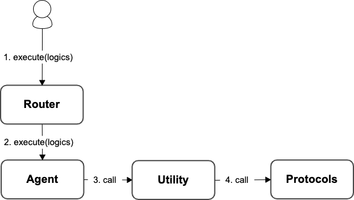

# Utility

In order to do specific operations (e.g., creating a CDP on the [Maker Protocol](https://docs.makerdao.com/)) that cannot be handled directly by `Agent`, Protocolink provides the **Utility**. Now, users are able to do `openLockETHAndDraw()` and `openLockGemAndDraw()` operations on their Agent thanks to the **MakerUtility.**

<figure><figcaption>
Utility Call Flow
</figcaption></figure>
